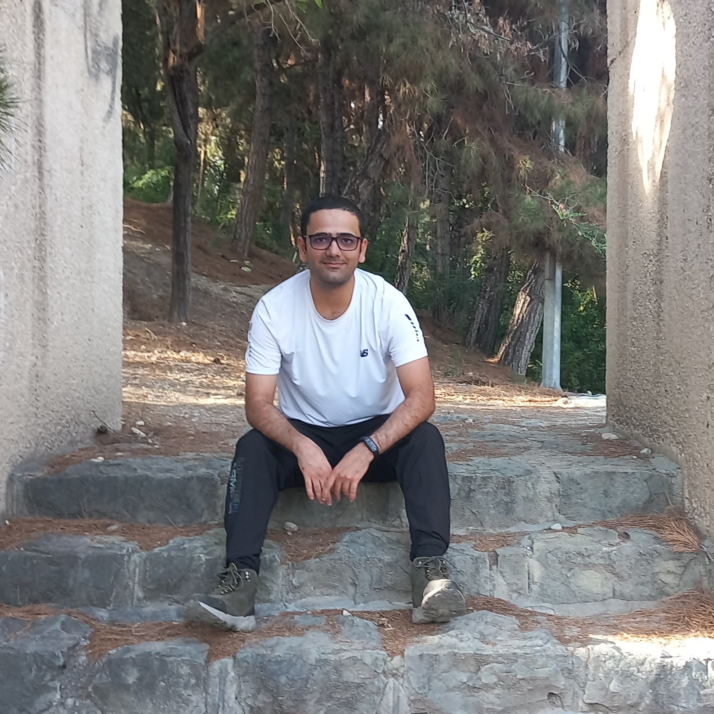
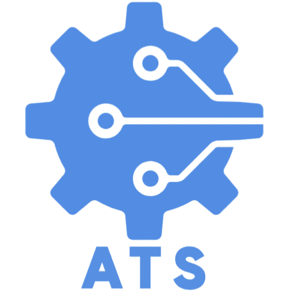
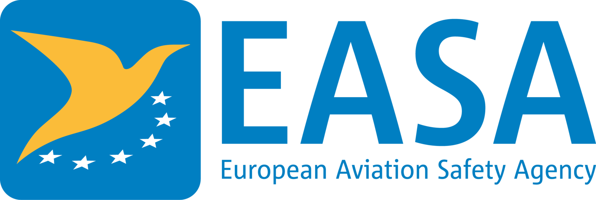
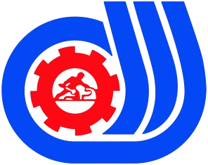
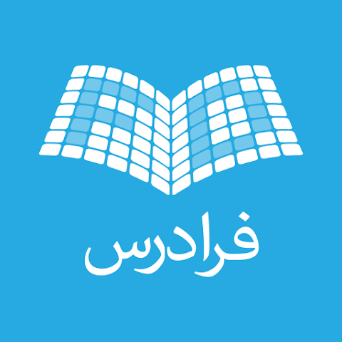

<!-- Font Awesome Icon Library -->
<link rel="stylesheet" href="https://cdnjs.cloudflare.com/ajax/libs/font-awesome/4.7.0/css/font-awesome.min.css">

<b> -- Always a Learner -- </b>

<b>Name: </b>Murtaza Asaadi

<b>B.day: </b>Dec. 26th 1993</td>

<b>Telegram: </b> <a href="https://t.me/mergenelos">@Mergenelos</a> 

<b>LinkedIn: </b> <a href="https://www.linkedin.com/in/murtaza-asaadi/">Murtaza Asaadi</a> 

<b>Mail: </b> <a href="mailto:mergenelos@gmail.com">mergenelos@gmail.com</a> 

I’ve been passionate about software development and circuit design, starting with programming on an old DOS computer. I quickly mastered languages like BASIC, C, and C++, and my curiosity led me to explore Linux, which sparked a lasting interest in open-source software. I soon participated in local discussions, learning about kernel development, networking, and more. This passion carried me through my academic studies in Electronics Engineering at Tabriz University, where I deepened my understanding of circuits, control systems, and microelectronics.

 

---
## Education

 
 

 

    
 
    <b>Tabriz University  
    Department of Computer & Electrical Engineering 
    Bachelor's degree -
    Electrical and Electronics Engineering</b> 
    <li><b>Thesis:</b> Implementing an ML based line follower on ROS</li>
    <li><b>Date:</b> 2012 - 2017</li>
    <li><b>GPA:</b> 3.0 of 5</li>
    <li><b>Adviser:</b> Professor Ghader Karimian</li>
    <li><b>Status:</b> Graduated</li>
    <button class="button">Academic Record</button> 
    

  

 
 

 
 
    
 
    <b>Sharif University of Technology  
    Department of Computer Engineering 
    Master of Science -
    Computer Architecture Engineering</b>  
    <li><b>Thesis:</b> Power-aware task scheduling on fog networks</li>
    <li><b>Date:</b> 2018 - 2021</li>
    <li><b>GPA:</b> 4.51 of 5</li>
    <li><b>Adviser:</b> Professor Alireza Ejlali</li>
    <li><b>Status:</b> Withdrawn</li>
    <button class="button">Academic Record</button>
    

  

 
 </td>

 
 
    
 
   <b> Tabriz University  
    Department of Computer & Electrical Engineering 
    Master of Science -
    Control Engineering </b> 
    <li><b>Thesis:</b> Soft robot control with reconfigurable joint positions</li>
    <li><b>Date:</b> 2023 - 2025</li>
    <li><b>GPA:</b> 4.0 of 5</li>
    <li><b>Adviser:</b> Professor Amir Rikhtehgar Ghiasi</li>
    <li><b>Status:</b> Graduated</li>
    <button class="button">Academic Record</button> 
    

  

 

---
## Experience

### Executive 
 <table style="border: none;">
  <tr style="border: none;">
<td style="width:20%;border: none;text-align: center;"></td>
<td style="border: none;text-align: left;">
<b>ATA Airlines - Full-time</b> 
<b>Maintenance Engineer</b> 
2025 - Present  
</td>
</tr>
<tr style="border: none;">
<td style="width:20%;border: none;text-align: center;"></td>
<td style="border: none;text-align: left;">
<b>Sama Industries - Full-time </b> 
<b>Head of Maintenance</b> 
2022 - 2025  
</td>
</tr>
<tr style="border: none;">
<td style="width:20%;border: none;text-align: center;"></td>
<td style="border: none;text-align: left;">
<b>Araz Takin Sahand - Part-time</b> 
<b>Owner</b> 
2019 - Present  
</td>
</tr>
</table>

### Teaching
 <table style="border: none;">
 <tr style="border: none;">
<td style="width:20%;border: none;text-align: center;"></td>
<td style="border: none;text-align: left;">
<b>Laboratory Instructor</b> 
<b>Digital System Design Laboratory</b> 
<b>Microcontroller Laboratory</b> 
Sharif University of Technology 
2019 - 2020  
</td>
</tr>
  <tr style="border: none;">
<td style="width:20%;border: none;text-align: center;"></td>
<td style="border: none;text-align: left;">
<b>Teaching Assistant</b> 
<b>Interface Circuits</b> 
University of Tabriz 
Jan - Jun 2016  
</td>
</tr>
</table>

 

---
## Certificates

### Vocational Education & Training
 <table style="border:none;">
  <tr style="border: none;">
    <td style="width:20%;border: none;text-align: center;"></td>
    <td style="border: none;">  
    
 
   <b> European Union Aviation Safety Agency </b> 
    <li>EASA Part-66 B2 license 
    Licensed Aircraft Electrical/Avionics Maintenance Engineer 
    </li> 
    <li>EASA Part-66 B1 license 
    Licensed Aircraft Mechanical Maintenance Engineer 
    </li>
    

    </td>
  <tr style="border: none;">
    <td style="width:20%;border: none;text-align: center;"></td>
    <td style="border: none;">  
    
 
   <b> Iran Technical and Vocational Training Organization </b> 
    <li>PLC Technician</li>
    <li>Autocad Technician</li>
    <li>SolidWorks Technician</li>
    <li>Milling Machine Operator</li>
    <li>Electrical Analysis Using Proteus</li>
    <li>Circuit Design Using Altium Designer</li>
    

    </td>
  </tr>
  <tr style="border: none;">
    <td style="width:20%;border: none;text-align: center;"></td>
    <td style="border: none;">  
    
 
   <b> Tabriz Machinery Manufacturing Co. </b> 
    <li>CNC Electrical Maintenance Specialist</li>
    <li>CNC Mechanical Maintenance Specialist</li>
    

    </td>
  </tr>    
</table> 

### Massive Open Online Courses
 <table style="border: none;">
  <tr style="border: none;">
    <td style="width:20%;border: none;text-align: center;"></td>
    <td style="border: none;">  
    
 
   <b> Coursera </b> 
    <li>Python 3 Programming by University of Michigan</li>
    <li>Mathematics for Machine Learning by Imperial College London</li>
    <li>Blockchain by University at Buffalo & The State University of New York </li>
    <li>Open Source Software Development, Linux and Git by The Linux Foundation </li>
    

    </td>
  </tr>
  <tr style="border: none;">
    <td style="width:20%;border: none;text-align: center;"></td>
    <td style="border: none;">  
    
 
   <b> Faradars </b> 
   <li>Fundamentals of Programming</li>
   <li>MATLAB Programming Essentials</li>
   <li>Python Programming - Beginner's Guide</li>
   <li>Mastering Python Programming: Hands-on Projects for Real-World Skills</li>
    <li>Mastering Automation Studio: Simulating Industrial Control Systems</li>
    

    </td>
  </tr>  
</table> 

 

---
## Skills

### Programming Languages

<b> MATLAB:</b>

  
  
  
  
  

<b> Python:</b>

  
  
  
  
  

<b> C & C++:</b>

  
  
  
  
  

<b> G-Code:</b>

  
  
  
  
  

<b> Ladder & STL:</b>

  
  
  
  
  

### Programs and Frameworks

<b> Proteus:</b>

  
  
  
  
  

<b> Altium Designer:</b>

  
  
  
  
  

<b> SolidWorks:</b>

  
  
  
  
  

<b> Powermill:</b>

  
  
  
  
  

<b> Simulink:</b>

  
  
  
  
  

<b> Maple(sim):</b>

  
  
  
  
  

<b> Siemens NX:</b>

  
  
  
  
  

<b> Auto. Studio:</b>

  
  
  
  
  

### Hardwares and Electronics

<b> Arduino:</b>

  
  
  
  
  

<b> AVR:</b>

  
  
  
  
  

<b> STM32:</b>

  
  
  
  
  

<b> RPI:</b>

  
  
  
  
  

<b> PIC18:</b>

  
  
  
  
  

<b> Siemens PLC:</b>

  
  
  
  
  

### Spoken Languages

<b> Turkish (AZ,TR):</b>

Native

<b> English:</b>

Fluent

<b> Persian:</b>

Fluent

<b> German:</b>

Proficient (B1)

<b> French:</b>

Basic (A2)

<b> Russian:</b>

Basic (A2)

---

## Papers & Publications
To be Updated ...